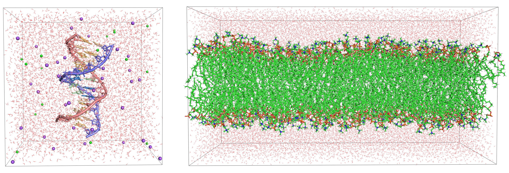

# chemtrain-deploy long-range benchmark

Integration and scaling test for [**chemtrain-deploy**](https://chemtrain.readthedocs.io/en/latest/) —
the LAMMPS deployment toolkit for JAX-trained machine-learning potentials — using the
**MACE-MH-1** foundation model on two chemically distinct periodic systems, across multiple GPUs.
Full chemtrain/chemtrain-deploy documentation, including the LAMMPS integration, model export
format, and foundation-model adapters, lives at
**https://chemtrain.readthedocs.io/en/latest/** (see its *Chemtrain-Deploy* section).


*Left: the DDD DNA duplex, TIP3P water, Na⁺/Cl⁻ ions. Right: the 400-lipid POPC bilayer, TIP3
water. Both from `structure/equilibrated.pdb` in their respective directories.*

## What's tested

Both benchmarks export the same **MACE-MH-1** multi-head foundation-model checkpoint with its
**`omol`** head selected (6.0 Å cutoff, 2 interaction/message-passing layers), as a CUDA
chemtrain-deploy bundle with OpenEquivariance FFI custom calls and the communication-enabled
(`comm on`) graph variant, then drive it in LAMMPS via `pair_style chemtrain` with Kokkos
(`-k on -sf kk`, device-side GPU-aware MPI communication). Runs hold coordinates fixed
(`run 0`/no time integration) and measure repeated force+energy evaluation throughput — this
isolates LAMMPS/connector/model performance from any question of whether the model is a
validated force field for either system.

| | **DDD** | **POPC_Bilayer** |
|---|---|---|
| System | Drew–Dickerson B-DNA dodecamer d(CGCGAATTCGCG)₂, TIP3P, 150 mM NaCl | 400-lipid CHARMM36 bilayer (200/leaflet), TIP3, no ions |
| Atoms | 18,914 | 107,600 |
| Box | 58.652³ Å (cube) | 158.2 × 79.1 × 80.8 Å (slab) |
| Structure | `DDD/structure/equilibrated.pdb` | `POPC_Bilayer/structure/equilibrated.pdb` |
| Built with | OpenMM, amber14/DNA.bsc1 + tip3p (`structure/config.json`) | OpenMM, CHARMM36 + flexible TIP3 (`structure/config.json`, `topol_big.top`, `toppar/`); source: Zenodo [10.5281/zenodo.1198158](https://zenodo.org/records/1198158) (NMRlipids/CHARMM-GUI), replicated 2×1×1 |
| GPU counts tested | 1, 2, 4, 7 | 5, 6, 7 (4 GPUs → **OOM**) |

GPU counts, `--memory-fraction`, and device IDs above are what ran *here*; see
[Site-specific settings](#site-specific-settings) for how to pick them on other hardware.

## Layout

```
benchmark/
  run_benchmark.py             orchestrates prepare -> export -> LAMMPS runs on N GPUs
  prepare_lammps_data.py       periodic PDB -> LAMMPS data file (ASE)
  export_mace_mh1_omol.py      MACE-MH-1/omol -> CUDA chemtrain-deploy bundle
  simulation.lmp               fixed-coordinate throughput benchmark input
  kokkos_neighbor_smoke.lmp    isolates Kokkos periodic neighbor-list construction from
                                chemtrain-deploy/JAX -- used to diagnose the CUDA-IPC issue below
  plot_scaling.py              reads the two summary.json + CRYST1 boxes -> scaling_speed.png
  scaling_speed.png            measured vs. ideal/approximate (Eq. 3) scaling, both systems
  models/
    mace_mh1_omol.ptb          exported model (identical for both systems, reused as-is)
    mace_mh1_omol.ptb.json     export metadata: heads, r_max, num_interactions, variants
  DDD/
    structure/
      equilibrated.pdb          the actual input: periodic, wrapped, CRYST1 set
      config.json                OpenMM equilibration protocol (force field, water model,
                                  ionic strength, temperature) that produced it
    1BNA_DNA.lmpdat             prepared LAMMPS data (regenerable from structure/equilibrated.pdb)
    summary.json / .csv         measured throughput, all GPU counts
    *.screen                    raw LAMMPS/mpirun output per run (gitignored, kept locally)
  POPC_Bilayer/
    structure/
      equilibrated.pdb          400-lipid bilayer, post-equilibration (see the project's
                                  POPC_Bilayer/README for the full 2x1x1-replication +
                                  flexible-water equilibration pipeline that built this)
      config.json                 equilibration protocol
      topol_big.top, toppar/       the exact CHARMM36 topology used to build it (provenance
                                    only -- the benchmark itself only needs equilibrated.pdb)
    POPC_bilayer.lmpdat
    summary.json / .csv
    *.screen                    includes the 4-GPU OOM failure log
build/
  lammps-host/, lammps-kokkos-cuda/, connector/    local LAMMPS + chemtrain-deploy builds
```

`structure/` is the actual input each benchmark needs and is checked in (small: 1.5 MB / 10 MB
PDBs plus a few KB of topology/config). `models/*.ptb`, `*.lmpdat`, and `*.screen` are
regenerable from it and gitignored; `summary.json/.csv` and the `.ptb.json` metadata are the
durable, small record of each run and stay tracked.

## Prerequisites

Create your own environment — this repo doesn't assume one already exists:

```bash
conda create -n chemtrain-deploy-benchmark python=3.12 -y
conda activate chemtrain-deploy-benchmark
python -m pip install -r requirements.txt
```

`chemtrain[cuda12]` is pinned to a `tummfm/chemtrain` `main` commit (the `[cuda12]` extra pulls
JAX's CUDA wheels; swap for `[cuda13]` on a CUDA 13 host). Move the pin forward as the repo
advances — a tagged release supersedes it once one exists. Everything else in the file is a
normal public install. `requirements.txt` is only the Python side; the connector/PJRT runtime
is a separate build, see the
[chemtrain-deploy installation guide](https://chemtrain.readthedocs.io/en/latest/chemtrain-deploy/installation.html).

Then build a CUDA/Kokkos MPI-enabled LAMMPS with `PKG_CHEMTRAIN-DEPLOY=ON` from
[`github.com/tummfm/lammps`](https://github.com/tummfm/lammps/tree/chemtrain-deploy), branch
`chemtrain-deploy` (built here at commit `553ca5e`), against a CUDA-aware OpenMPI, and point the
benchmark at the build:

```bash
export LAMMPS_EXECUTABLE=/path/to/lammps/build/lammps-kokkos-cuda/lmp
export CHEMTRAIN_DEPLOY_LIB=/path/to/lammps/build/connector
export MPI_LAUNCHER="mpirun --mca btl_smcuda_use_cuda_ipc 0"
```

The `--mca btl_smcuda_use_cuda_ipc 0` flag works around an OpenMPI/CUDA interaction seen beyond 2
ranks: the `smcuda` transport can fail to register its shared-memory buffer, and the next Kokkos
kernel then reports `cudaErrorIllegalAddress`. Disabling only CUDA IPC keeps the CUDA-aware
transport active and avoids it — `kokkos_neighbor_smoke.lmp` isolates the same periodic Kokkos
neighbor list without chemtrain-deploy/JAX, if you need to re-diagnose it.

## Running it

```bash
cd benchmark

# DDD -- builds 1BNA_DNA.lmpdat from the checked-in structure and exports the model fresh
# (omit --checkpoint entirely to download MACE-MH-1 automatically instead)
python run_benchmark.py --pdb DDD/structure/equilibrated.pdb \
  --checkpoint ~/.cache/mace/macemh1model --kokkos \
  --cuda-devices <free GPU ids> --gpu-counts 1,2,4

# POPC bilayer -- reuse the DDD export (same weights/head), only prepare a new data file
python run_benchmark.py --pdb POPC_Bilayer/structure/equilibrated.pdb \
  --data-file POPC_Bilayer/POPC_bilayer.lmpdat --output-directory POPC_Bilayer \
  --skip-export --model models/mace_mh1_omol.ptb \
  --kokkos --cuda-devices <free GPU ids> --gpu-counts 5,6,7 --memory-fraction <see below>
```

`--gpu-counts` accepts any of `1, 2, 4, 5, 6, 7` (`PROCESSOR_GRIDS` in `run_benchmark.py`); 1/2/4
split as `(1,1,1)`/`(2,1,1)`/`(2,2,1)`, and 5/6/7 split only the longest box axis as `(P,1,1)`.
The exported model and LAMMPS data file are reused as-is with `--skip-export --model ...` /
`--skip-prepare --data-file ...` — the model is identical across systems (same checkpoint, same
`omol` head), so it only needs exporting once.

`--cuda-devices` and `--memory-fraction` depend on the GPUs you have — see
[Site-specific settings](#site-specific-settings) for the values used here and how to adapt them.

## Results

`benchmark/scaling_speed.png` plots measured throughput for both systems against two references
from the chemtrain-deploy paper: **ideal** strong scaling (S(P) = P, the zero-overhead ceiling —
black in the paper's own Figure 2) and the paper's **approximate** strong scaling, Eq. 3,

```
S(P) = [ (L + 2TR) / (P^(-1/d) L + 2TR) ]^d
```

evaluated with **T = 1** (halo depth in cutoffs) and R = 6.0 Å cutoff, generalized to each
system's actual `(px, py, pz)` LAMMPS grid rather than the paper's cubic `P^(1/d)` shorthand,
since DDD's box is a cube but the bilayer is an anisotropic slab.

`T = 1`, not the omol head's 2 message-passing layers, because these runs use the
**communication-enabled (`comm on`) model variant**: intermediate features are exchanged
between ranks after each message-passing step, so a rank only needs ghost atoms within *one*
cutoff of its faces, not the full `num_interactions · r_max` receptive field. `comm off` runs
would use `T = 2`.

Regenerate the figure after any run with `python benchmark/plot_scaling.py` (needs only
`matplotlib`; reads the tracked `summary.json` files and the `structure/equilibrated.pdb` box
records).

| System | GPUs | Grid | Atoms/rank | steps/s | atom·steps/s | Eff. vs. ideal | Eff. vs. Eq. 3 |
|---|---:|---|---:|---:|---:|---:|---:|
| DDD | 1 | 1×1×1 | 18,914 | 0.964 | 18,232 | 100% | 100% |
| DDD | 2 | 2×1×1 | 9,457 | 1.563 | 29,560 | 81% | 95% |
| DDD | 4 | 2×2×1 | 4,729 | 2.369 | 44,811 | 61% | 84% |
| DDD | 7 | 7×1×1 | 2,702 | 2.841 | 53,731 | 42% | 85% |
| POPC | 4 | 2×2×1 | 26,900 | — | — | — | **OOM** |
| POPC | 5 | 5×1×1 | 21,520 | 0.674 | 72,506 | 100% | 100% |
| POPC | 6 | 6×1×1 | 17,933 | 0.791 | 85,124 | 98% | 103% |
| POPC | 7 | 7×1×1 | 15,371 | 0.879 | 94,622 | 93% | 103% |

(DDD normalized to its 1-GPU point, POPC to its smallest working 5-GPU point — for POPC, 1–4
GPUs all exceed the exported model's fixed-capacity graph on a single 80 GB GPU, hence the
4-GPU OOM and the 5-GPU baseline. See [Site-specific settings](#site-specific-settings).)

DDD sits below Eq. 3 (84–85%): at 7×1×1 its 58.65 Å cube is cut into 8.4 Å slabs, thinner than
the 6 Å cutoff, so real inter-rank communication and neighbor-list overhead dominate what the
ghost-volume model ignores. POPC runs ~3% *above* Eq. 3 because its 5-GPU baseline is itself
throttled (`--memory-fraction 0.95`, near the card limit) and the model is partly
memory-bandwidth-bound, so per-atom throughput improves as each rank's partition shrinks —
neither effect is in Eq. 3's fixed cost-per-atom assumption.

See `benchmark/DDD/summary.json` and `benchmark/POPC_Bilayer/summary.json` for the full
per-run numbers (wall time, per-rank atom counts, physical GPU IDs), and the `.screen` files for
raw LAMMPS output, including the OOM traceback.

## Site-specific settings

**Hardware:** For our test we used a single node with NVIDIA A100-SXM4 **80 GB** (NVLink), CUDA 12.6,
CUDA-aware OpenMPI 4.1.5. All runs are single-node; MPI ranks map 1:1 to GPUs.

| Knob | DDD | POPC_Bilayer | How to choose it elsewhere |
|---|---|---|---|
| `--cuda-devices` | `0,1,2,3` | Any list of currently-free GPU ids on the node (`nvidia-smi`). Length must be ≥ the largest `--gpu-counts` value. The specific ids here just reflect what was idle — GPU 2 was in use. |
| `--gpu-counts` | `1,2,4,7` | Must be keys of `PROCESSOR_GRIDS` in `run_benchmark.py` (`1,2,4,5,6,7`; 3 GPUs has no grid). POPC does not fit below 5 GPUs on 80 GB cards (see `--memory-fraction`); on larger-memory GPUs it would start lower, on smaller ones it needs more. |
| `--memory-fraction` | `0.75` | `0.95` | Fraction of *each GPU's* memory handed to the XLA BFC pool for the fixed-capacity model graph. POPC's larger per-rank atom/edge counts need a bigger pool, so it sits just under 1.0; DDD has slack. Scale roughly with `(per-rank atoms) / (GPU memory)` — raise it until the model graph allocates, back off if LAMMPS/Kokkos or MPI buffers then get squeezed. |

The `MPI_LAUNCHER` CUDA-IPC workaround in [Prerequisites](#prerequisites) is an OpenMPI issue,
not a hardware one — it applies to any multi-node-capable OpenMPI build, and is harmless if your
MPI doesn't need it.